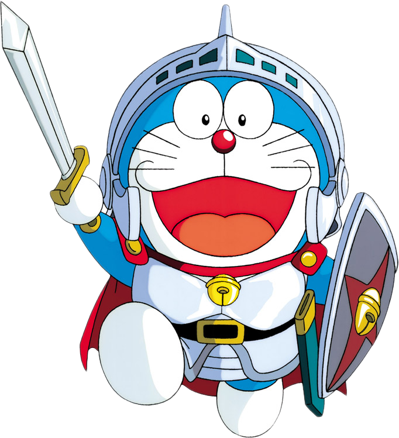

  

  <h1>Baolin Liu (刘宝林)</h1>

  

    <strong>3D AIGC · MLLM · Image processing</strong> 
    Ph.D. student in Computer Science and Technology, Beijing University of Posts and Telecommunications
  

  

    <a href="https://scholar.google.com/citations?user=vSxklo8AAAAJ&hl=zh-CN">Google Scholar</a>
  

## About

I am a Ph.D. student in Computer Science and Technology at Beijing University of Posts and Telecommunications. I am interested in 3D AIGC, multimodal large language models, image processing, document image restoration, scene text super-resolution, point cloud understanding, and light-field / naked-eye 3D display.

My recent work explores generative models and visual representation learning for practical image enhancement, 3D understanding, 3D generation, and immersive display applications.

## Research Interests

- 3D AIGC and native 3D understanding / generation
- Multimodal large language models
- Image processing, document enhancement, and scene text image super-resolution
- Point cloud segmentation and 3D scene understanding
- Light-field rendering, editing, and naked-eye 3D display

## Publications

| Year | Author order | Title | Authors | Venue |
| --- | --- | --- | --- | --- |
| 2026 | First author | StereoEdit: A Diffusion-Based Framework for Stereo-Consistent Image Editing | **B Liu**, Z Yang, Y Song, Y Xiong | ECCV 2026 |
| 2026 | First author | ELF: Edit anything for light field displays | **B Liu**, Z Yang, Y Song, Y Xiong | Pattern Recognition 2026 |
| 2026 | First author | PFR-Net: Reliability-Ordered Evidence Routing for Light Field Denoising | **B Liu**, Y Song, Z Yang, Y Xiong | PRCV 2026 |
| 2025 | First author | TextDiff: Enhancing scene text image super-resolution with mask-guided residual diffusion models | **B Liu**, Z Yang, C Chiu, Y Xiong | Pattern Recognition 2025 |
| 2025 | Co-first author | EYE3: Turn Anything into Naked-eye 3D | Y Song, Z Yang, **B Liu**, Y Xiong, S Chen, L Yi, Z Zhang, X Yu | ICCV 2025 |
| 2024 | Co-first author | DirectL: Efficient Radiance Fields Rendering for 3D Light Field Displays | Z Yang, **B Liu**, Y Song, L Yi, Y Xiong, Z Zhang, X Yu | TOG 2024 |
| 2024 | Co-first author | GDB: gated convolutions-based document binarization | Z Yang, **B Liu**, Y Xiong, G Wu | Pattern Recognition 2024 |
| 2026 | Other author | EVA01: Unified Native 3D Understanding and Generation via Mixture-of-Transformers | Z Yang, M Yi, W Ma, C Fan, B Li, **B Liu**, Y Lou, Y Song, Y Xiong, Z Guo, ... | arXiv 2026 |
| 2024 | Other author | Fat: Field-aware transformer for point cloud segmentation with adaptive attention fields | J Zhou, **B Liu**, Y Xiong, C Chiu, F Liu, X Gong | IEEE TII 2024 |
| 2023 | Other author | Docdiff: Document enhancement via residual diffusion models | Z Yang, **B Liu**, Y Xxiong, L Yi, G Wu, X Tang, Z Liu, J Zhou, X Zhang | ACM MM 2023 |

## Links

- Google Scholar: <https://scholar.google.com/citations?user=vSxklo8AAAAJ&hl=zh-CN>

Avatar image source: <https://freepngimg.com/png/80602-dorami-animation-ornament-doraemon-christmas-free-hd-image>
